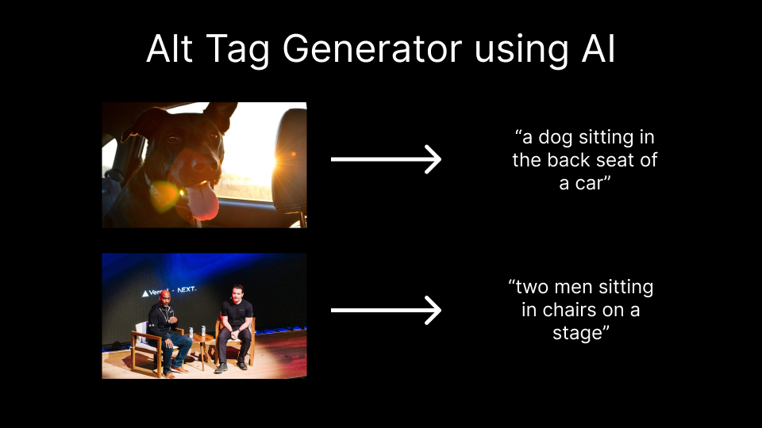

# Alt Image Generator

This project will generate relevant alt text for images using AI.



## How it works

It uses an ML modal from Salesforce called [BLIP](https://github.com/salesforce/BLIP) on [Replicate](https://replicate.com/) to generate relevant alt text for images. You can feed the Next.js API route an image as a query param and it will return a one sentence description of that image.

## Project setup

Make sure to install the dependencies.

```bash
yarn install
```

After cloning the repo, go to [Replicate](https://replicate.com/) to make an account and put your API key in a file called `.env.local`.

### Compiles and hot-reloads for development

Then, run the application in the command line and it will be available at `http://localhost:3000`.

```bash
yarn dev
```

### How to use

To use the API route, go to the link below in your browser or run a curl command in your terminal to get a sample result. Feel free to replace the dub.sh link with a link to any image.

```bash
curl http://localhost:3000/api/generate?imageUrl=https://dub.sh/confpic
```

### Compiles and minifies for production

Use this step to build a local production version of the site. Use `start` to preview the local build.

```bash
yarn build
yarn start
```

### Requirements

- Node.js >= 16.14.0
- Yarn 1 (Classic)

### Directory Structure

- [`.github`](.github) — GitHub configuration including the CI workflow.<br>
- [`.husky`](.husky) — Husky configuration and hooks.<br>
- [`public`](./public) — Static assets such as robots.txt, images, and favicon.<br>
- [`pages`](./pages) — Application source code, including pages, components, styles.

### Scripts

- `yarn dev` — Starts the application in development mode at `http://localhost:3000`.
- `yarn build` — Creates an optimized production build of your application.
- `yarn start` — Starts the application in production mode.
- `yarn type-check` — Validate code using TypeScript compiler.
- `yarn lint` — Runs ESLint for all files in the `src` directory.
- `yarn format` — Runs Prettier for all files in the `src` directory.

## License

This project is licensed under the MIT License - see the [LICENSE.md](LICENSE.md) file for more information.

Note: You will not need to do anything to the hosted site. Continuous Delivery has been setup with Vercel. All you need to do is push your commit and wait for it to deploy.

## Acknowledgements

A special thank you to Vercel for hosting this application.


